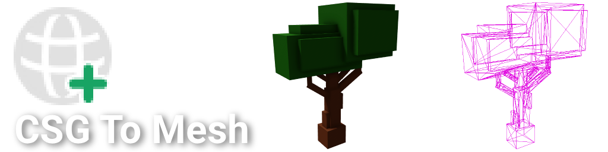

# rbx-csg-to-mesh-plugin



CSG To Mesh is a plugin that converts CSG part operations into editable meshes. This can be used to convert many scenes into meshes which as a byproduct allows you to access the triangle data. This can be very valuable for generating and modifying assets in studio.

Keep in mind editable meshes don’t save and must be published before using in an actual game.

## How was this achieved?

When local unions are saved as `rbxm` or `rbxmx` files they contain their rendered mesh data in a special format. This plugin serializes unions into the rbxm format and then reads and parses the mesh data into an editable mesh.

It's worth emphasizing that all unions that run through this plugin get cloned and unioned with nothing. This seems like a really random step, but it ensures that the union we're reading from is local and not storing its mesh data in the cloud.

This was only achievable due to the [amazing work of krakow10](https://github.com/krakow10/rbx_mesh) in reverse engineering the csg mesh format. I used their work to write the lua parser and in the event that Roblox changes the CSG format I make no guarantees of future support.

## How do I use this?

The easiest way to use this plugin is to simply select a union or a "unionable" part and then click the plugin button "CSG To Mesh". This will create and select an overlapping mesh part on your selection.

Alternatively, if you're looking to use this for automation purposes. This plugin also creates a binding module under the AssetService called "CSGToMeshBindings".

```luau
local CSGToMesh = require(game:GetService("AssetService"):WaitForChild("CSGToMeshBindings"))

CSGToMesh.toMeshPart(union: UnionOperation): MeshPart
```

## Why would I need this?

This plugin essentially gives you the ability to convert anything that can become a union operation into a mesh. This means you can effectively interface with a large body of common roblox assets as meshes.

For example in the following video this plugin is used to convert a happy home to a mesh and then rotate the vertices so it can be skewed.

https://github.com/user-attachments/assets/1f598c5a-010e-4f13-b09f-60f13d1e7289
